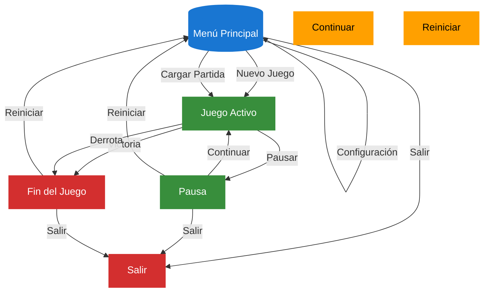

# Flujo Principal del Juego

```mermaid
graph TD
    classDef menu fill:#1976d2,color:#fff,stroke:#1976d2
    classDef juego fill:#388e3c,color:#fff,stroke:#388e3c
    classDef fin fill:#d32f2f,color:#fff,stroke:#d32f2f
    classDef decision fill:#ffa000,color:#000,stroke:#ffa000

    Menu[("Menú Principal")]:::menu
    Juego["Juego Activo"]:::juego
    Pausa["Pausa"]:::juego
    Fin["Fin del Juego"]:::fin
    Salir["Salir"]:::fin
    Continuar["Continuar"]:::decision
    Reiniciar["Reiniciar"]:::decision

    Menu -->|"Nuevo Juego"| Juego
    Menu -->|"Cargar Partida"| Juego
    Menu -->|"Configuración"| Menu
    Menu -->|"Salir"| Salir
    
    Juego -->|"Pausar"| Pausa
    Pausa -->|"Continuar"| Juego
    Pausa -->|"Reiniciar"| Menu
    Pausa -->|"Salir"| Salir
    
    Juego -->|"Victoria"| Fin
    Juego -->|"Derrota"| Fin
    Fin -->|"Reiniciar"| Menu
    Fin -->|"Salir"| Salir
```