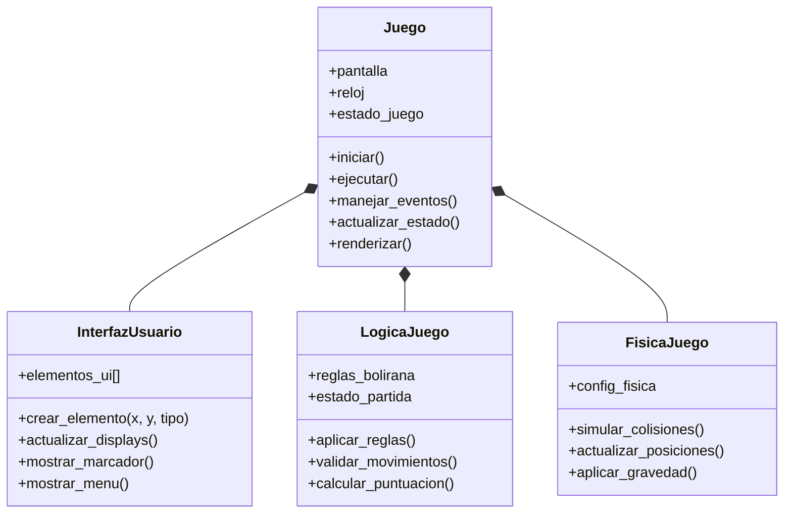

# Diagrama de Clases

```mermaid
classDiagram
    class Juego {
        +pantalla
        +reloj
        +estado_juego
        +iniciar()
        +ejecutar()
        +manejar_eventos()
        +actualizar_estado()
        +renderizar()
    }
    
    class InterfazUsuario {
        +elementos_ui[]
        +crear_elemento(x, y, tipo)
        +actualizar_displays()
        +mostrar_marcador()
        +mostrar_menu()
    }
    
    class LogicaJuego {
        +reglas_bolirana
        +estado_partida
        +aplicar_reglas()
        +validar_movimientos()
        +calcular_puntuacion()
    }
    
    class FisicaJuego {
        +config_fisica
        +simular_colisiones()
        +actualizar_posiciones()
        +aplicar_gravedad()
    }
    
    Juego *-- InterfazUsuario
    Juego *-- LogicaJuego
    Juego *-- FisicaJuego
```